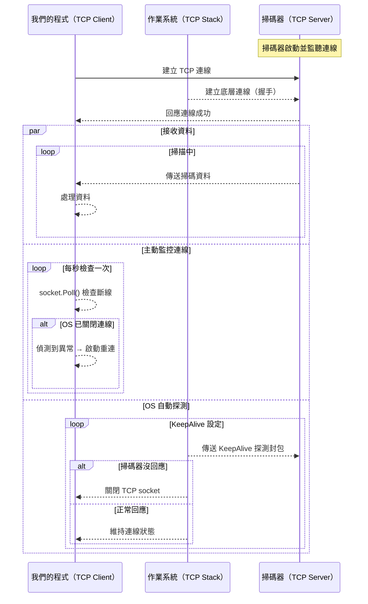

```mermaid
sequenceDiagram
    participant Client as 我們的程式（TCP Client）
    participant OS as 作業系統（TCP Stack）
    participant Scanner as 掃碼器（TCP Server）

    Note over Scanner: 掃碼器啟動並監聽連線
    Client->>Scanner: 建立 TCP 連線
    OS-->>Scanner: 建立底層連線（握手）
    Scanner-->>Client: 回應連線成功

    par 接收資料
        loop 掃描中
            Scanner-->>Client: 傳送掃碼資料
            Client-->>Client: 處理資料
        end
    and 主動監控連線
        loop 每秒檢查一次
            Client-->>Client: socket.Poll() 檢查斷線
            alt OS 已關閉連線
                Client-->>Client: 偵測到異常 → 啟動重連
            end
        end
    and OS 自動探測
        loop KeepAlive 設定
            OS-->>Scanner: 傳送 KeepAlive 探測封包
            alt 掃碼器沒回應
                OS-->>Client: 關閉 TCP socket
            else 正常回應
                OS-->>Client: 維持連線狀態
            end
        end
    end
```